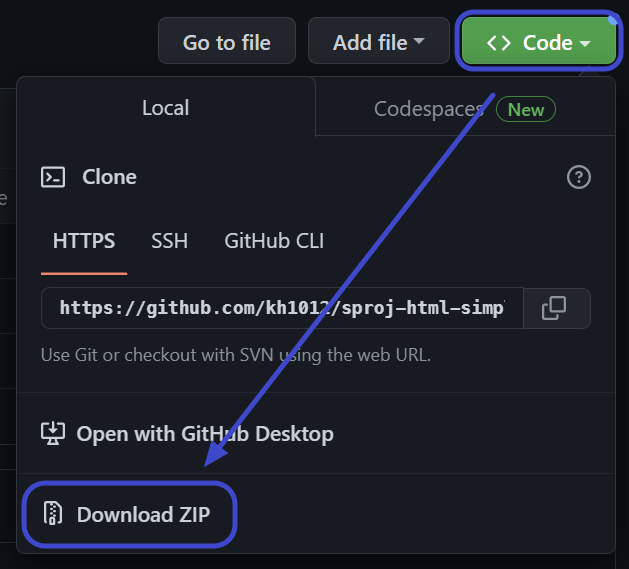

# :zap: Getting Stated With HTML Simple Table

MIDAS API 중 "GET NODE"를 통해 API를 경험할 수 있는 저장소 입니다.\
HTML Table 태그를 이용해서 DOM Element의 innerHTML을 치환하여 브라우져 UI에 API로부터 받은 데이터를 출력하는 예제 입니다.
  

## [Demo Page](https://kh1012.github.io/sproj-html-simple-table/src/index.html)
위 링크를 클릭하시면 테스트 페이지를 보실 수 있습니다.
  

## Quick Start

해당 저장소를 사용하기 위한 준비 과정을 안내합니다.
  

### 자신의 PC에 저장소 다운로드 받기
 

- 현 페이지 우측 상단에 `Code` 버튼을 눌러 `Download ZIP`을 클릭하여 저장소를 다운로드 받습니다.\
   
  
- 다운로드가 완료되면 원하는 경로에 압축을 해제 합니다.\
   
  
  

### 바로 실행 해보기
 

- 해제한 폴더를 열어 "./src/index.html"을 실행 해주세요.\
   
  
  

## Plugin Development

해당 저장소를 사용하려면 [Getting Started With HTML](https://github.com/kh1012/sproj-prerequisite/tree/main/html)에 포함된 환경이 모두 구성되어 있어야 합니다. \
가능한 안내 된 프로그램을 다운로드 받으시고 최신 버전을 사용하는 것이 좋습니다. `LTS`
  

### 주요 코드 설명
 

- /src 폴더 내에 `index.html`에 저장소의 모든 내용이 담겨 있습니다.
  - 내부의 `<body>`는 2가지로 구분 되어 있습니다.
    - 실제 HTML의 동작을 정의 해주는 javascript 부분이 있습니다.
      - 주요한 변수 및 함수는 다음과 같습니다.
      - `baseUrl`: MIDAS API Server의 Url 입니다.
      - function `getMapiKey()`: URL QueryString으로부터 MAPI-Key를 가져오는 함수 입니다.
      - function `getNodeFetch()`: MIDAS API를 통해 연결된 제품의 Node 정보를 가져 옵니다.
        - 함수 내부에서 HTML의 Table 태그인 `<table>, <thead>, <tbody>, <tr>, <th>, <td>`를 사용하고 있습니다. 더 많은 정보는 [MDN-TABLE](https://developer.mozilla.org/ko/docs/Web/HTML/Element/table) 이곳을 확인해 보세요!
    - 웹 페이지에 표현을 담당하는 HTML([MDN-HTML](https://developer.mozilla.org/ko/docs/Web/HTML)) 부분이 존재합니다.
      - ul, li 태그를 활용하여 리스트로 표현되어 있습니다.
        - [MDN-ul](https://developer.mozilla.org/ko/docs/Web/HTML/Element/ul) 에 대해 확인해 보세요!
        - [MDN-li](https://developer.mozilla.org/ko/docs/Web/HTML/Element/li) 에 대해 확인해 보세요!
