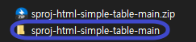

# :zap: Getting Stated With HTML Simple Table

This repository offers M-API experiences using the "GET NODE" function.\
This example displays received API data on the browser UI by substituting the innerHTML of DOM Element using the HTML button tag.
  

## [Demo Page](https://kh1012.github.io/sproj-html-simple-table/src/index.html)
You can move to the test page through the link.
  

## Quick Start

Introduce the preparation process to use this repository.
  

### Download the repository on the user's personal computer
 

- Download the repository by clicking 'Code' and the 'Download ZIP' button on the upper right side of this page.\
   
  
- Unzip the downloaded folder and designate the folder path as the user wants.\
   
  
  

### Try it Right Now
 

Open the unzip downloaded folder and run "./src/index.html."\
   
  
  

## Plugin Development

Before using this repository, the user needs prerequisites, including all [Getting Started With HTML](https://github.com/kh1012/sproj-prerequisite/tree/main/html). \
As possible, it is good to download guided software and use the latest version. `LTS`
  

### Main Code Information
 

- All repository data is in `index.html` in the/src folder.
  - The inner `<body>` consists of two sections.
    - JavaScript has the part of defining the behavior of actual HTML.
      - Important variables and functions are as below.
      - `baseUrl`: URL in the MIDAS API Server.
      - function `getMapiKey()`: The function that brings the MAPI-KEY from URL QueryString.
      - function `getNodeFetch()`: Brings Node information from connected product through MIDAS API.
        - Inside the function, HTML table tags `<table>, <thead>, <tbody>, <tr>, <th>, <td>` are used. For more information, Please check Here! [MDN-TABLE](https://developer.mozilla.org/ko/docs/Web/HTML/Element/table)
     - There is a web page's appearance section in the part of HTML.([MDN-HTML](https://developer.mozilla.org/ko/docs/Web/HTML))
      - It appears as a list using ul and li tags.
        - Please check about [MDN-ul](https://developer.mozilla.org/ko/docs/Web/HTML/Element/ul)!
        - Please check about [MDN-li](https://developer.mozilla.org/ko/docs/Web/HTML/Element/li)!
